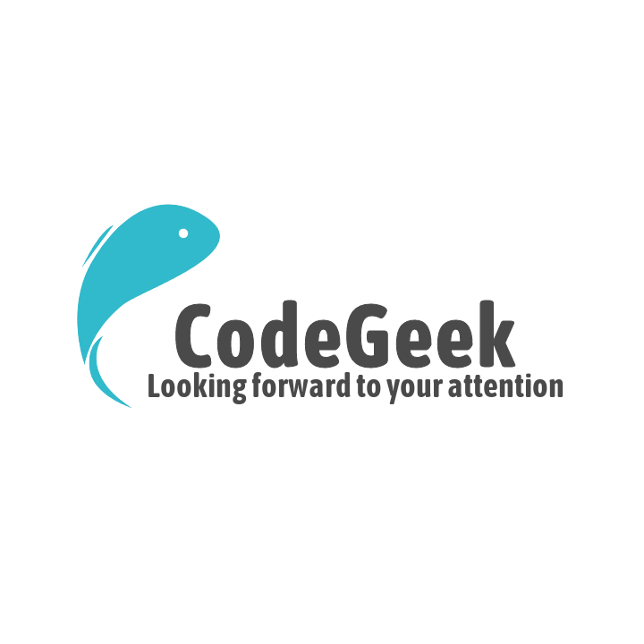

- 此项目是利用业余时间，对一些技术知识点进行整理，用来记录个人学习笔记。这个项目和 [study](https://github.com/xiaoshuanglee/study) 项目的不同在于 [study](https://github.com/xiaoshuanglee/study) 是用来动手实践，对于一些技术的实际搭建和造轮子的项目，正所谓实践出真知。相关的源码都会在上边。两个项目结合就是理论+实践。欢迎大家Star和follow！

<!--Site View : -->

 

[开始阅读](README.md)